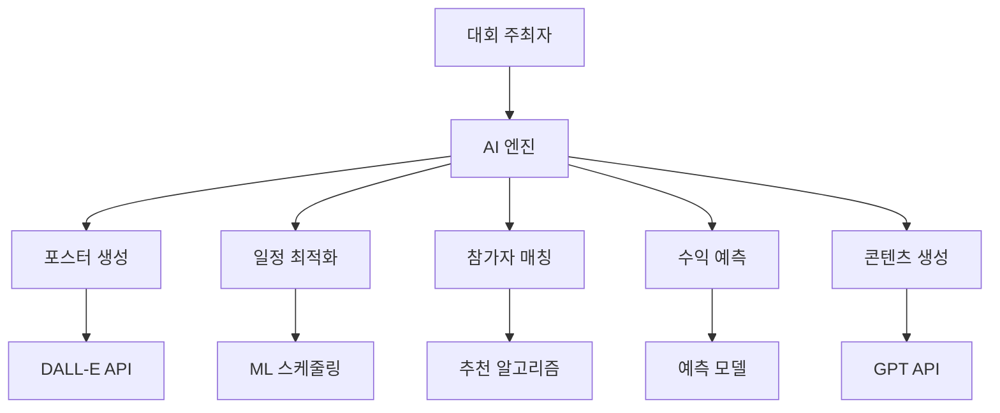

# 🤖 BDR 대회 AI 기능 명세서

## 개요
AI 기술을 활용하여 대회 주최자의 업무를 자동화하고, 참가자에게는 개인화된 경험을 제공하는 스마트 대회 플랫폼 구축

## AI 기능 아키텍처



## 1. AI 포스터 생성 시스템 🎨

### 1.1 기술 스택
- **이미지 생성**: OpenAI DALL-E 3 API
- **텍스트 처리**: GPT-4 API
- **이미지 편집**: Canvas API
- **저장소**: AWS S3

### 1.2 포스터 생성 프로세스

#### Step 1: 프롬프트 생성
```ruby
def generate_poster_prompt(tournament)
  base_prompt = "Professional basketball tournament poster design"
  
  style_prompts = {
    modern: "minimalist, clean lines, bold typography",
    vintage: "retro 90s style, grunge texture, nostalgic",
    street: "urban graffiti style, vibrant colors, dynamic",
    professional: "corporate, elegant, premium quality"
  }
  
  elements = [
    "basketball players in action",
    "tournament trophy",
    tournament.venue,
    "dramatic lighting",
    style_prompts[tournament.poster_style]
  ]
  
  "#{base_prompt}, #{elements.join(', ')}, high quality, 4K"
end
```

#### Step 2: AI 이미지 생성
```ruby
def generate_poster_image(tournament)
  client = OpenAI::Client.new(access_token: ENV['OPENAI_API_KEY'])
  
  response = client.images.generate(
    parameters: {
      model: "dall-e-3",
      prompt: generate_poster_prompt(tournament),
      size: "1024x1024",
      quality: "hd",
      n: 3  # 3개 옵션 생성
    }
  )
  
  response.dig("data").map { |img| img["url"] }
end
```

#### Step 3: 텍스트 오버레이
```javascript
async function addTextOverlay(imageUrl, tournament) {
  const canvas = document.createElement('canvas');
  const ctx = canvas.getContext('2d');
  
  // 이미지 로드
  const img = await loadImage(imageUrl);
  canvas.width = img.width;
  canvas.height = img.height;
  ctx.drawImage(img, 0, 0);
  
  // 텍스트 추가
  ctx.font = 'bold 72px Noto Sans KR';
  ctx.fillStyle = '#FFFFFF';
  ctx.shadowBlur = 10;
  ctx.shadowColor = '#000000';
  
  // 대회명
  ctx.fillText(tournament.name, 50, 100);
  
  // 날짜
  ctx.font = '48px Noto Sans KR';
  ctx.fillText(tournament.date, 50, 180);
  
  // 장소
  ctx.fillText(tournament.venue, 50, 240);
  
  return canvas.toDataURL();
}
```

### 1.3 포스터 템플릿 AI 학습
- **사용자 피드백 수집**: 선택된 포스터 스타일 기록
- **선호도 학습**: 지역별, 연령별 선호 스타일 분석
- **자동 개선**: 인기 요소 자동 반영

## 2. 스마트 일정 최적화 🗓️

### 2.1 제약 조건 처리
```python
# 일정 최적화 알고리즘
class TournamentScheduler:
    def __init__(self, tournament):
        self.tournament = tournament
        self.constraints = []
        
    def add_constraints(self):
        # 경기장 가용 시간
        self.constraints.append(VenueAvailability())
        
        # 팀 간 최소 휴식 시간
        self.constraints.append(MinimumRestTime(minutes=30))
        
        # 동시 경기 수 제한
        self.constraints.append(MaxConcurrentGames(limit=2))
        
        # 프라임 타임 우선 배치
        self.constraints.append(PrimeTimePreference())
    
    def optimize_schedule(self):
        # 유전자 알고리즘 사용
        ga = GeneticAlgorithm(
            population_size=100,
            generations=1000,
            mutation_rate=0.1
        )
        
        return ga.solve(self.constraints)
```

### 2.2 머신러닝 기반 예측
- **경기 시간 예측**: 과거 데이터 기반 경기 소요 시간 예측
- **지연 위험 감지**: 날씨, 교통 등 외부 요인 고려
- **동적 조정**: 실시간 상황 반영한 일정 재조정

## 3. 참가자 매칭 AI 🎯

### 3.1 실력 기반 매칭
```ruby
class SkillBasedMatcher
  def match_teams(players)
    # 선수 실력 점수 계산
    player_scores = players.map do |player|
      {
        player: player,
        score: calculate_skill_score(player)
      }
    end
    
    # K-means 클러스터링으로 균형잡힌 팀 구성
    kmeans = KMeans.new(k: team_count)
    clusters = kmeans.fit(player_scores)
    
    balance_teams(clusters)
  end
  
  private
  
  def calculate_skill_score(player)
    # 다차원 실력 평가
    {
      offense: player.stats.ppg * 0.3,
      defense: player.stats.blocks * 0.2,
      teamwork: player.ratings.teamwork * 0.3,
      experience: player.games_played * 0.2
    }.values.sum
  end
end
```

### 3.2 성향 기반 매칭
- **플레이 스타일**: 공격적/수비적/균형형
- **포지션 균형**: 각 팀의 포지션 분배
- **케미스트리**: 함께 플레이한 이력 고려

## 4. 수익 예측 모델 💰

### 4.1 시계열 예측
```python
import tensorflow as tf
from tensorflow.keras.models import Sequential
from tensorflow.keras.layers import LSTM, Dense

class RevenuePredictor:
    def __init__(self):
        self.model = self.build_model()
        
    def build_model(self):
        model = Sequential([
            LSTM(50, activation='relu', input_shape=(30, 5)),
            Dense(25, activation='relu'),
            Dense(1)
        ])
        
        model.compile(optimizer='adam', loss='mse')
        return model
    
    def prepare_features(self, tournament):
        return np.array([
            tournament.entry_fee,
            tournament.max_teams,
            tournament.venue_popularity,
            tournament.day_of_week,
            tournament.season_factor
        ])
    
    def predict_revenue(self, tournament):
        features = self.prepare_features(tournament)
        prediction = self.model.predict(features)
        
        return {
            'expected_revenue': prediction[0],
            'confidence_interval': (prediction[0] * 0.8, prediction[0] * 1.2),
            'break_even_teams': tournament.fixed_costs / tournament.entry_fee
        }
```

### 4.2 동적 가격 최적화
- **수요 예측**: 신청 속도 기반 수요 예측
- **가격 탄력성**: 참가비 변화에 따른 신청률 변화
- **최적 가격 제안**: 수익 극대화 가격 포인트

## 5. 콘텐츠 자동 생성 📝

### 5.1 대회 소개문 생성
```ruby
def generate_tournament_description(tournament)
  prompt = <<~PROMPT
    다음 정보로 매력적인 농구 대회 소개문을 작성해주세요:
    - 대회명: #{tournament.name}
    - 날짜: #{tournament.date}
    - 장소: #{tournament.venue}
    - 참가비: #{tournament.entry_fee}
    - 상금: #{tournament.total_prize}
    
    톤: 열정적이고 프로페셔널한
    길이: 200-300자
  PROMPT
  
  gpt_client.completions(
    model: "gpt-4",
    messages: [{ role: "user", content: prompt }],
    temperature: 0.7
  )
end
```

### 5.2 자동 하이라이트 생성
- **경기 요약**: 주요 득점 장면 텍스트 요약
- **MVP 선정**: 통계 기반 자동 MVP 선정
- **소셜 미디어 캡션**: 플랫폼별 최적화된 캡션

## 6. AI 챗봇 어시스턴트 💬

### 6.1 대회 문의 자동 응답
```javascript
const tournamentChatbot = {
  intents: {
    registration: {
      patterns: ["신청", "참가", "등록"],
      response: (tournament) => `${tournament.name} 참가 신청은 
        ${tournament.registrationUrl}에서 가능합니다. 
        마감일은 ${tournament.deadline}입니다.`
    },
    
    schedule: {
      patterns: ["일정", "시간", "언제"],
      response: (tournament) => `대회 일정:
        - 신청 마감: ${tournament.registrationEnd}
        - 대회 시작: ${tournament.startDate}
        - 경기 시간: ${tournament.gameTime}`
    },
    
    rules: {
      patterns: ["규칙", "룰", "규정"],
      response: (tournament) => tournament.rules
    }
  },
  
  processQuery(query, tournament) {
    // NLP로 의도 파악
    const intent = this.detectIntent(query);
    return this.intents[intent].response(tournament);
  }
};
```

### 6.2 개인화 추천
- **대회 추천**: 사용자 실력/위치 기반 대회 추천
- **팀 매칭**: 비슷한 실력의 팀원 추천
- **일정 알림**: 개인 일정 고려한 대회 알림

## 7. AI 성능 모니터링 📊

### 7.1 모델 성능 지표
- **포스터 생성**
  - 사용자 선택률
  - 생성 시간
  - API 비용
  
- **일정 최적화**
  - 제약 조건 만족도
  - 참가자 만족도
  - 일정 변경 횟수
  
- **수익 예측**
  - MAE (Mean Absolute Error)
  - 예측 정확도
  - 비즈니스 임팩트

### 7.2 지속적 개선
```python
class AIModelManager:
    def __init__(self):
        self.models = {}
        self.performance_tracker = PerformanceTracker()
        
    def evaluate_models(self):
        for model_name, model in self.models.items():
            metrics = self.performance_tracker.get_metrics(model_name)
            
            if metrics['accuracy'] < 0.8:
                self.retrain_model(model_name)
            
            if metrics['latency'] > 1000:  # ms
                self.optimize_model(model_name)
    
    def a_b_test(self, model_a, model_b, test_size=0.1):
        # A/B 테스트로 모델 성능 비교
        results = {
            'model_a': [],
            'model_b': []
        }
        
        for request in test_requests:
            if random.random() < 0.5:
                results['model_a'].append(model_a.process(request))
            else:
                results['model_b'].append(model_b.process(request))
        
        return self.compare_results(results)
```

## 구현 우선순위

### High Priority
1. AI 포스터 생성 (즉시 가치 제공)
2. 자동 일정 최적화 (운영 효율성)
3. 대회 설명 자동 생성 (시간 절약)

### Medium Priority
4. 수익 예측 모델 (비즈니스 인사이트)
5. 참가자 매칭 AI (사용자 경험)
6. 챗봇 어시스턴트 (고객 지원)

### Low Priority
7. 고급 분석 기능
8. 실시간 최적화
9. 멀티모달 AI 기능

## 기술 요구사항

### API 연동
- OpenAI API (GPT-4, DALL-E 3)
- Google Cloud Vision API
- AWS Rekognition
- TensorFlow Serving

### 인프라
- GPU 서버 (이미지 생성)
- Redis (캐싱)
- PostgreSQL (벡터 DB)
- Kubernetes (스케일링)

### 보안
- API 키 관리
- 사용자 데이터 암호화
- 모델 접근 제어
- 비용 모니터링

## 예상 효과

### 정량적 효과
- 대회 생성 시간: 30분 → 5분 (83% 감소)
- 포스터 디자인 비용: 10만원 → 0원
- 참가자 증가율: +40%
- 운영 오류: -90%

### 정성적 효과
- 전문적인 대회 이미지
- 주최자 만족도 향상
- 참가자 경험 개선
- 플랫폼 차별화

## 결론
AI 기술을 통해 BDR은 단순한 매칭 플랫폼을 넘어 지능형 대회 운영 플랫폼으로 진화할 수 있습니다. 주최자에게는 강력한 도구를, 참가자에게는 최적화된 경험을 제공하여 농구 커뮤니티의 성장을 이끌어갈 것입니다.