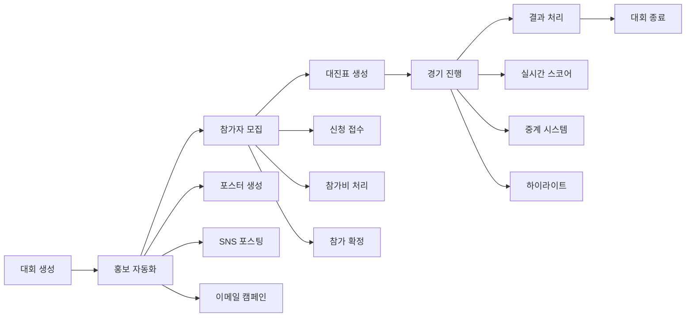

# ⚙️ BDR 대회 자동화 워크플로우

## 개요
대회 생성부터 종료까지의 전 과정을 자동화하여 주최자의 운영 부담을 최소화하고 참가자 경험을 극대화하는 워크플로우 시스템

## 자동화 아키텍처



## 1. 대회 생성 자동화 🚀

### 1.1 원클릭 대회 생성
```ruby
class TournamentAutomation
  def create_tournament_with_automation(params)
    tournament = Tournament.create!(params)
    
    # 자동화 작업 큐에 추가
    TournamentSetupJob.perform_later(tournament)
    CreatePosterJob.perform_later(tournament)
    SchedulePromotionJob.perform_later(tournament)
    SetupNotificationJob.perform_later(tournament)
    
    tournament
  end
end
```

### 1.2 템플릿 기반 설정
```yaml
# tournament_templates.yml
weekend_league:
  name: "주말 농구 리그"
  type: "round_robin"
  duration: 2 # days
  games_per_day: 8
  break_time: 15 # minutes
  default_rules: "FIBA 3x3"
  
summer_tournament:
  name: "여름 토너먼트"
  type: "single_elimination"
  duration: 1 # day
  games_per_day: 16
  break_time: 10
  default_rules: "KBL 공식"
```

### 1.3 자동 검증 시스템
- **날짜 충돌 검사**: 같은 장소/시간 중복 방지
- **최소 요구사항 체크**: 참가팀, 심판, 장소 확인
- **규정 준수 확인**: 대회 규모별 필수 요소

## 2. 홍보 자동화 📢

### 2.1 마케팅 캠페인 스케줄러
```ruby
class MarketingCampaign
  def schedule_for_tournament(tournament)
    # D-30: 대회 공지
    schedule_announcement(tournament, days_before: 30)
    
    # D-21: 얼리버드 마감 안내
    schedule_early_bird_reminder(tournament, days_before: 21)
    
    # D-14: 정규 신청 오픈
    schedule_regular_registration(tournament, days_before: 14)
    
    # D-7: 마감 임박 알림
    schedule_deadline_reminder(tournament, days_before: 7)
    
    # D-3: 최종 안내
    schedule_final_notice(tournament, days_before: 3)
  end
  
  private
  
  def schedule_announcement(tournament, days_before:)
    MarketingJob.set(
      wait_until: tournament.start_date - days_before.days
    ).perform_later(
      tournament: tournament,
      template: 'announcement',
      channels: [:email, :sms, :push, :sns]
    )
  end
end
```

### 2.2 멀티채널 발송 시스템
```javascript
const MultiChannelSender = {
  async send(tournament, template, channels) {
    const content = await this.generateContent(tournament, template);
    
    const results = await Promise.all(
      channels.map(channel => {
        switch(channel) {
          case 'email':
            return this.sendEmail(content);
          case 'sms':
            return this.sendSMS(content);
          case 'push':
            return this.sendPush(content);
          case 'sns':
            return this.postToSNS(content);
        }
      })
    );
    
    return this.trackResults(results);
  },
  
  async generateContent(tournament, template) {
    // AI를 활용한 맞춤형 콘텐츠 생성
    return {
      title: await AI.generateTitle(tournament, template),
      body: await AI.generateBody(tournament, template),
      image: await AI.generateImage(tournament, template),
      hashtags: await AI.generateHashtags(tournament)
    };
  }
};
```

### 2.3 SNS 자동 포스팅
```python
class SocialMediaAutomation:
    def __init__(self):
        self.platforms = {
            'instagram': InstagramAPI(),
            'facebook': FacebookAPI(),
            'twitter': TwitterAPI(),
            'kakao': KakaoAPI()
        }
    
    def post_tournament_update(self, tournament, update_type):
        content = self.prepare_content(tournament, update_type)
        
        for platform, api in self.platforms.items():
            try:
                if platform == 'instagram':
                    # 이미지 필수
                    api.post_photo(
                        image=content['image'],
                        caption=content['caption'],
                        hashtags=content['hashtags']
                    )
                elif platform == 'twitter':
                    # 280자 제한
                    api.post_tweet(
                        text=self.truncate_for_twitter(content['caption']),
                        media=content['image']
                    )
                # ... 각 플랫폼별 처리
                
            except Exception as e:
                self.log_error(platform, e)
```

## 3. 참가자 관리 자동화 👥

### 3.1 신청 프로세스 자동화
```ruby
class RegistrationAutomation
  def process_application(application)
    # 1. 자격 검증
    return reject_application(application) unless validate_eligibility(application)
    
    # 2. 중복 신청 확인
    return handle_duplicate(application) if duplicate_application?(application)
    
    # 3. 팀 구성 확인 (팀 대회의 경우)
    return request_team_info(application) if team_info_incomplete?(application)
    
    # 4. 자동 승인 또는 대기
    if application.tournament.auto_approve?
      approve_and_notify(application)
    else
      add_to_waiting_list(application)
    end
  end
  
  private
  
  def validate_eligibility(application)
    # 나이, 실력, 지역 등 자격 요건 확인
    checks = [
      check_age_requirement(application),
      check_skill_level(application),
      check_location_restriction(application),
      check_previous_participation(application)
    ]
    
    checks.all?
  end
end
```

### 3.2 참가비 자동 처리
```javascript
class PaymentAutomation {
  async processPayment(application) {
    try {
      // 1. 결제 요청 생성
      const paymentRequest = await this.createPaymentRequest(application);
      
      // 2. 결제 링크 발송
      await this.sendPaymentLink(application.user, paymentRequest);
      
      // 3. 결제 상태 모니터링
      this.monitorPaymentStatus(paymentRequest, {
        onSuccess: () => this.confirmRegistration(application),
        onFailure: () => this.handlePaymentFailure(application),
        onTimeout: () => this.sendPaymentReminder(application)
      });
      
    } catch (error) {
      this.handleError(error, application);
    }
  }
  
  monitorPaymentStatus(paymentRequest, callbacks) {
    const checkInterval = setInterval(async () => {
      const status = await this.checkPaymentStatus(paymentRequest);
      
      switch(status) {
        case 'completed':
          clearInterval(checkInterval);
          callbacks.onSuccess();
          break;
        case 'failed':
          clearInterval(checkInterval);
          callbacks.onFailure();
          break;
        case 'pending':
          if (this.isTimeout(paymentRequest)) {
            clearInterval(checkInterval);
            callbacks.onTimeout();
          }
          break;
      }
    }, 60000); // 1분마다 체크
  }
}
```

### 3.3 대기자 관리 시스템
```ruby
class WaitlistManager
  def check_availability(tournament)
    return unless tournament.has_waitlist?
    
    available_spots = tournament.max_teams - tournament.confirmed_teams.count
    
    if available_spots > 0
      promote_from_waitlist(tournament, available_spots)
    end
  end
  
  def promote_from_waitlist(tournament, spots)
    waitlist = tournament.applications.waiting.order(:created_at)
    
    waitlist.limit(spots).each do |application|
      application.update(status: 'approved')
      
      # 승인 알림 및 결제 안내
      NotificationService.send(
        user: application.user,
        type: 'waitlist_promotion',
        data: {
          tournament: tournament,
          payment_deadline: 48.hours.from_now
        }
      )
      
      # 48시간 타이머 설정
      WaitlistPromotionTimeoutJob.set(wait: 48.hours)
                                 .perform_later(application)
    end
  end
end
```

## 4. 대진표 자동 생성 🏆

### 4.1 시드 배정 알고리즘
```python
class SeedingAlgorithm:
    def generate_seeding(self, teams, method='skill_based'):
        if method == 'skill_based':
            return self.skill_based_seeding(teams)
        elif method == 'random':
            return self.random_seeding(teams)
        elif method == 'regional':
            return self.regional_seeding(teams)
        elif method == 'historical':
            return self.historical_seeding(teams)
    
    def skill_based_seeding(self, teams):
        # 팀 평균 실력 계산
        team_scores = []
        for team in teams:
            avg_skill = sum([p.skill_rating for p in team.players]) / len(team.players)
            team_scores.append((team, avg_skill))
        
        # 실력 순으로 정렬
        team_scores.sort(key=lambda x: x[1], reverse=True)
        
        # 시드 배정 (1-16, 2-15, 3-14...)
        seeded_matchups = []
        n = len(team_scores)
        for i in range(n // 2):
            seeded_matchups.append((
                team_scores[i][0],      # 상위 시드
                team_scores[n-1-i][0]   # 하위 시드
            ))
        
        return seeded_matchups
```

### 4.2 대진표 시각화
```javascript
class BracketVisualizer {
  generateBracket(tournament) {
    const bracket = {
      rounds: this.calculateRounds(tournament.teams.length),
      matches: []
    };
    
    // 라운드별 매치 생성
    let currentMatches = this.createFirstRound(tournament.teams);
    bracket.matches.push(currentMatches);
    
    for (let round = 2; round <= bracket.rounds; round++) {
      currentMatches = this.createNextRound(currentMatches);
      bracket.matches.push(currentMatches);
    }
    
    return this.renderBracket(bracket);
  }
  
  renderBracket(bracket) {
    return `
      <div class="tournament-bracket">
        ${bracket.matches.map((round, index) => `
          <div class="round round-${index + 1}">
            <h3>Round ${index + 1}</h3>
            ${round.map(match => `
              <div class="match" data-match-id="${match.id}">
                <div class="team team-top ${match.winner === match.team1 ? 'winner' : ''}">
                  ${match.team1.name}
                  <span class="score">${match.score1 || '-'}</span>
                </div>
                <div class="team team-bottom ${match.winner === match.team2 ? 'winner' : ''}">
                  ${match.team2.name}
                  <span class="score">${match.score2 || '-'}</span>
                </div>
              </div>
            `).join('')}
          </div>
        `).join('')}
      </div>
    `;
  }
}
```

## 5. 경기 진행 자동화 🏀

### 5.1 실시간 스코어 시스템
```ruby
class LiveScoreSystem
  def initialize(match)
    @match = match
    @redis = Redis.new
    @channel = "match:#{match.id}:live"
  end
  
  def update_score(team, points)
    # 점수 업데이트
    if team == :home
      @match.home_score += points
    else
      @match.away_score += points
    end
    
    # Redis에 실시간 업데이트
    @redis.publish(@channel, {
      type: 'score_update',
      match_id: @match.id,
      home_score: @match.home_score,
      away_score: @match.away_score,
      timestamp: Time.current
    }.to_json)
    
    # 데이터베이스 업데이트
    @match.save!
    
    # 이벤트 트리거
    check_game_events
  end
  
  private
  
  def check_game_events
    # 쿼터 종료
    if quarter_ended?
      trigger_quarter_end
    end
    
    # 경기 종료
    if game_ended?
      trigger_game_end
    end
    
    # 역전
    if lead_changed?
      trigger_lead_change
    end
  end
end
```

### 5.2 자동 중계 시스템
```javascript
class AutoCommentary {
  constructor(match) {
    this.match = match;
    this.events = [];
    this.templates = this.loadTemplates();
  }
  
  generateCommentary(event) {
    const template = this.templates[event.type];
    const commentary = this.fillTemplate(template, event);
    
    this.broadcast({
      time: event.timestamp,
      text: commentary,
      type: event.type,
      importance: this.calculateImportance(event)
    });
  }
  
  fillTemplate(template, event) {
    return template
      .replace('{player}', event.player.name)
      .replace('{team}', event.team.name)
      .replace('{points}', event.points)
      .replace('{time}', this.formatTime(event.timestamp));
  }
  
  calculateImportance(event) {
    // 중요도 계산 (클러치 타임, 점수 차, 이벤트 타입 등)
    let importance = event.baseImportance || 1;
    
    if (this.isClutchTime()) importance *= 2;
    if (this.isClosGame()) importance *= 1.5;
    if (event.type === 'buzzer_beater') importance *= 3;
    
    return Math.min(importance, 10);
  }
}
```

### 5.3 하이라이트 자동 생성
```python
class HighlightGenerator:
    def __init__(self, match):
        self.match = match
        self.events = []
        
    def track_event(self, event):
        # 중요 이벤트 기록
        if self.is_highlight_worthy(event):
            self.events.append({
                'type': event.type,
                'time': event.timestamp,
                'players': event.players,
                'score_impact': event.score_change,
                'importance': self.calculate_importance(event)
            })
    
    def generate_highlights(self):
        # 중요도 순으로 정렬
        sorted_events = sorted(
            self.events, 
            key=lambda x: x['importance'], 
            reverse=True
        )
        
        # 상위 10개 하이라이트 선정
        top_highlights = sorted_events[:10]
        
        # 시간 순으로 재정렬
        timeline_highlights = sorted(
            top_highlights, 
            key=lambda x: x['time']
        )
        
        return self.create_highlight_reel(timeline_highlights)
    
    def is_highlight_worthy(self, event):
        highlight_types = [
            'three_pointer',
            'dunk',
            'block',
            'steal_and_score',
            'buzzer_beater',
            'and_one',
            'comeback_moment'
        ]
        
        return event.type in highlight_types
```

## 6. 결과 처리 자동화 📊

### 6.1 통계 자동 집계
```ruby
class StatisticsProcessor
  def process_game_end(game)
    # 개인 통계 집계
    process_player_stats(game)
    
    # 팀 통계 집계
    process_team_stats(game)
    
    # 대회 통계 업데이트
    update_tournament_stats(game.tournament)
    
    # MVP 자동 선정
    select_game_mvp(game)
    
    # 하이라이트 생성
    generate_highlights(game)
  end
  
  private
  
  def process_player_stats(game)
    game.player_stats.each do |stat|
      player = stat.player
      
      # 시즌 통계 업데이트
      player.season_stats.update!(
        games_played: player.season_stats.games_played + 1,
        total_points: player.season_stats.total_points + stat.points,
        total_rebounds: player.season_stats.total_rebounds + stat.rebounds,
        total_assists: player.season_stats.total_assists + stat.assists
      )
      
      # 개인 기록 체크
      check_personal_records(player, stat)
      
      # 업적 체크
      check_achievements(player, stat)
    end
  end
  
  def select_game_mvp(game)
    # 효율성 지표 계산 (PER)
    mvp_candidate = game.player_stats.max_by do |stat|
      calculate_player_efficiency(stat)
    end
    
    game.update!(mvp: mvp_candidate.player)
    
    # MVP 뱃지 부여
    mvp_candidate.player.add_achievement('game_mvp')
  end
end
```

### 6.2 자동 시상식
```javascript
class AwardCeremony {
  async processTournamentEnd(tournament) {
    const awards = await this.calculateAwards(tournament);
    
    // 시상 내역 생성
    const ceremony = {
      champion: awards.champion,
      runnerUp: awards.runnerUp,
      mvp: awards.mvp,
      bestDefender: awards.bestDefender,
      bestScorer: awards.bestScorer,
      bestTeamwork: awards.bestTeamwork,
      allStarTeam: awards.allStarTeam
    };
    
    // 시상식 페이지 생성
    await this.generateAwardPage(ceremony);
    
    // 수상자 알림
    await this.notifyWinners(ceremony);
    
    // 소셜 미디어 공유
    await this.shareResults(ceremony);
    
    // 상금 자동 지급
    await this.distributePrizes(ceremony);
  }
  
  async distributePrizes(ceremony) {
    const prizeDistribution = tournament.prizePool;
    
    // 우승팀 상금
    await this.transferPrize(
      ceremony.champion,
      prizeDistribution.first
    );
    
    // 준우승팀 상금
    await this.transferPrize(
      ceremony.runnerUp,
      prizeDistribution.second
    );
    
    // MVP 상금
    if (prizeDistribution.mvp) {
      await this.transferPrize(
        ceremony.mvp,
        prizeDistribution.mvp
      );
    }
  }
}
```

## 7. 대회 종료 후 자동화 🎯

### 7.1 피드백 수집
```ruby
class FeedbackAutomation
  def collect_post_tournament_feedback(tournament)
    participants = tournament.all_participants
    
    participants.each do |participant|
      # 맞춤형 설문 생성
      survey = generate_personalized_survey(participant, tournament)
      
      # 설문 발송
      FeedbackMailer.post_tournament(
        user: participant,
        tournament: tournament,
        survey_link: survey.url
      ).deliver_later
      
      # 리마인더 스케줄
      FeedbackReminderJob.set(wait: 3.days)
                        .perform_later(participant, survey)
    end
  end
  
  private
  
  def generate_personalized_survey(participant, tournament)
    Survey.create!(
      user: participant,
      tournament: tournament,
      questions: build_questions(participant, tournament),
      incentive: calculate_incentive(participant)
    )
  end
end
```

### 7.2 다음 대회 추천
```python
class NextTournamentRecommender:
    def __init__(self):
        self.model = self.load_recommendation_model()
        
    def recommend_tournaments(self, user, completed_tournament):
        # 사용자 프로필 벡터
        user_vector = self.vectorize_user(user)
        
        # 대회 특성 벡터
        tournament_vector = self.vectorize_tournament(completed_tournament)
        
        # 유사 대회 검색
        similar_tournaments = self.find_similar_tournaments(
            user_vector, 
            tournament_vector
        )
        
        # 개인화 순위 조정
        ranked_tournaments = self.personalize_ranking(
            similar_tournaments,
            user
        )
        
        return ranked_tournaments[:5]
    
    def personalize_ranking(self, tournaments, user):
        factors = {
            'location_match': 0.3,
            'skill_match': 0.3,
            'schedule_match': 0.2,
            'price_match': 0.2
        }
        
        scored_tournaments = []
        for tournament in tournaments:
            score = sum([
                self.calculate_factor_score(tournament, user, factor) * weight
                for factor, weight in factors.items()
            ])
            scored_tournaments.append((tournament, score))
        
        return [t[0] for t in sorted(scored_tournaments, key=lambda x: x[1], reverse=True)]
```

## 모니터링 및 분석 📈

### 자동화 성과 대시보드
```javascript
const AutomationDashboard = {
  metrics: {
    timesSaved: {
      tournamentCreation: '평균 25분 → 5분',
      participantManagement: '수동 0% → 자동 95%',
      resultProcessing: '평균 2시간 → 즉시'
    },
    
    errorRates: {
      registration: '< 0.1%',
      payment: '< 0.5%',
      scheduling: '< 0.01%'
    },
    
    userSatisfaction: {
      organizers: '92% 만족',
      participants: '88% 만족',
      nps: '+67'
    }
  },
  
  generateReport() {
    return {
      summary: this.calculateSummary(),
      improvements: this.identifyImprovements(),
      recommendations: this.generateRecommendations()
    };
  }
};
```

## 구현 로드맵

### Phase 1: 기본 자동화 (1-2개월)
- [ ] 대회 생성 템플릿
- [ ] 기본 알림 시스템
- [ ] 참가 신청 자동 처리

### Phase 2: 고급 자동화 (3-4개월)
- [ ] AI 포스터 생성
- [ ] 자동 대진표 생성
- [ ] 실시간 스코어 시스템

### Phase 3: 통합 자동화 (5-6개월)
- [ ] 멀티채널 마케팅
- [ ] 통계 자동 집계
- [ ] 피드백 수집 시스템

### Phase 4: 지능형 자동화 (7-8개월)
- [ ] 예측 분석
- [ ] 개인화 추천
- [ ] 완전 자동화 워크플로우

## 기대 효과

### 정량적 효과
- **운영 시간**: 90% 감소
- **오류율**: 95% 감소
- **참가율**: 40% 증가
- **만족도**: 35% 향상

### 정성적 효과
- 주최자 부담 최소화
- 참가자 경험 향상
- 대회 품질 표준화
- 플랫폼 신뢰도 증가

## 결론
완전한 자동화 워크플로우를 통해 BDR은 대회 운영의 새로운 표준을 제시합니다. 주최자는 대회의 핵심인 '농구'에만 집중할 수 있고, 참가자는 최상의 경험을 누릴 수 있습니다.